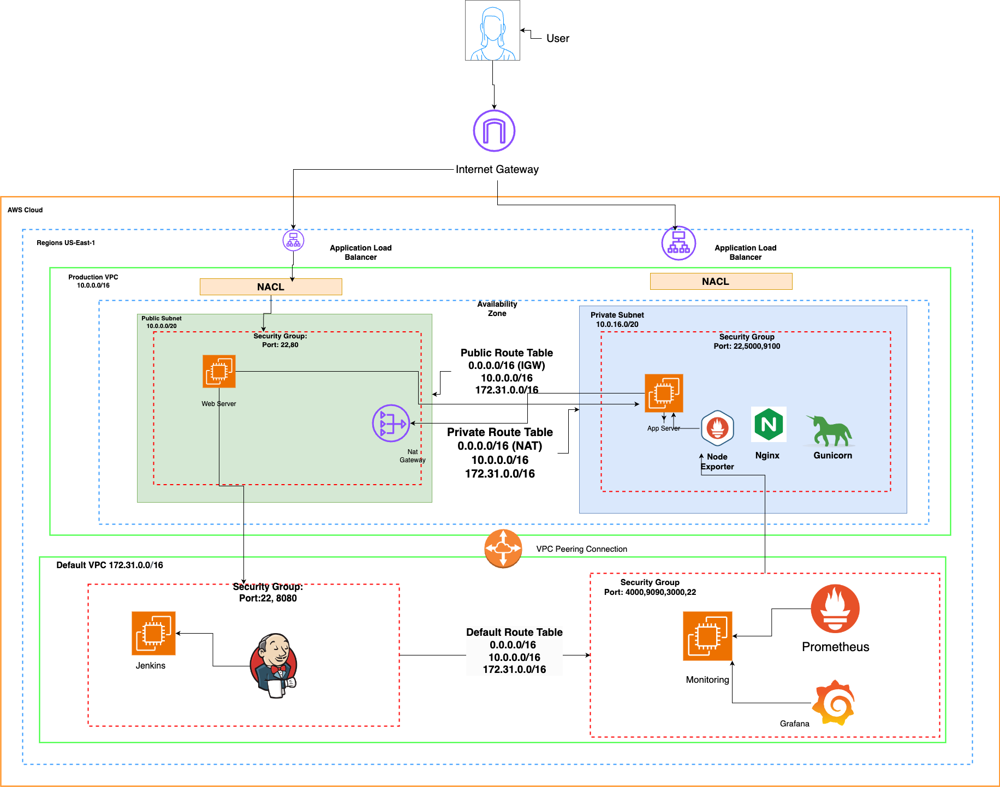

# Microblog VPC Deployment - Documentation

## Purpose
This workload focuses on deploying an application using a custom AWS VPC and the default VPC using EC2 instances for Jenkins, web, and application servers. The workload also focused on various concepts including: VPC Peering, Routing, and MonitoringThe goal is to implement a scalable infrastructure, manage server communication securely, and automate deployment pipelines using Jenkins.

## Steps Taken

1. **VPC Setup:**
   - **Why:** Provides network isolation, enhancing security and control.
   - Created a custom VPC for the Web Server and Application Server
      - Created a public subnet for web server 
      - Created private subnet + NAT Gateway for Application Server
      - Make Route Tables for Public and Private Subnets
  - Navigate to subnets and edit the settings of the public subet you created to auto assign public IPv4 addresses.
  - In the Default VPC, create an EC2 t3.medium called "Jenkins" and install Jenkins onto it. 
  - Set up VPC Peering Connection between default vpc and production vpc 

2. **EC2 Instance Setup:**
   - **Why:** Segregates services and roles, improving security and management.
   - Created instances for Jenkins (t3.medium), Web Server (t3.micro), and Application Server (t3.micro).
   - Attach Jenkins Server to Default VPC 
   - Attach Web Server and Application Server to Production VPC
   - Attach "Web_Server" Into the PUBLIC SUBNET of the Production VPC
         - create a security group with ports 22 and 80 open.  
   - Attach "Application_Server" to the PRIVATE SUBNET of the Production VPC
         -  create a security group with ports 22, 5000, 9100
   - Make sure you create and save the key pair to your local machine.

3. **Key Authentication:**
   - **Why:** Establishes secure communication between servers.
   - Generated an SSH key on Jenkins, sharing it with the Web Server to enable secure access.
   - SSH into the "Jenkins" server and run `ssh-keygen`. Copy the public key that was created and append it into the "authorized_keys" file in the Web Server
   - Copy the key pair (.pem file) of the "Application_Server" to the "Web_Server".
   - Test the connection by SSH'ing into the "Application_Server" from the "Web_Server"

4. **Nginx Configuration:**
   - **Why:** Acts as a reverse proxy to forward traffic from the Web Server to the Application Server.
   - Configured Nginx to forward requests to the private IP of the Application Server.
   - In the Web Server, install NginX and modify the "sites-enabled/default" file so that the "location" section reads as below:
```
location / {
proxy_pass http://<private_IP>:5000;
proxy_set_header Host $host;
proxy_set_header X-Forwarded-For $proxy_add_x_forwarded_for;
}
```
- Be sure to replace `<private_IP>` with the private IP address of the application server. Run the command `sudo nginx -t` to verify. Restart NginX 

5. **Script Creation:**
   - **start_app.sh** (Application Server): Sets up the Flask application with dependencies, environment variables, and runs it using Gunicorn.
   - **setup.sh** (Web Server): Remotely runs `start_app.sh` via SSH.
   
   **Why:** Automates application deployment, reducing manual intervention.

6. **Jenkins Pipeline:**
   - **Why:** Automates build, test, and deployment processes.
   - Created a Jenkinsfile to build, test (pytest), and deploy the application by running scripts on the Web and Application Servers.

7. **Monitoring Setup:**
   - **Why:** Tracks performance and health of the system.
   - create an EC2 t3.micro called "Monitoring"
   - Attach to Default VPC
   - Create Security Group that opens ports: 22, 9090, 3000, 4000
   - Set up Prometheus and Grafana to monitor the Application Server.
     

     


## System Design Diagram


## Issues/Troubleshooting
- **Key Pair Issues:** SSH permission errors were resolved by copying the Application Server key to the Web Server.
- **Jenkins Deploy Issues:**
  

  Running into issues with the deploy stage of the Jenkins build. The issue was with permissions and owner ship of the /var/lib/jenkins/.ssh/workload4KeyPair.pem file. To troubleshoot, I had to update the owner and permissions of the the file path to jenkins. Then changed the permissions to 600. There was also a syntacical error with my Jenkins Build Deploy Stage, I was missing the closing qoutation around my path to ssh into the Web Server
  


## Optimization
- **Separation of Environments:** Allows testing in a non-production environment, mitigating risk. The current setup addresses this by using different servers for Jenkins, the web, and the application.
- **Improvements:** Consider auto-scaling and load balancing for better resilience and optimizing cost.

## Conclusion
This workload demonstrates the process of building and automating an application deployment within a secure, scalable AWS environment. By separating roles, automating processes, and integrating monitoring, it provides a foundation for more advanced deployments in real-world scenarios.
